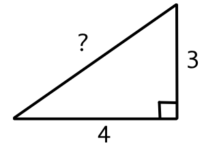

## Introduction

The aim of this article is to provide new teachers with a framework for planning effective lessons.

The methodology presented below is effective across all ages and subjects. It is derived from my own experiences in the classroom, professional training, graduate coursework, and insights from veteran teachers.

## Identify Purpose

Precisely identify the skill your students will gain after completing the lesson.

**Example:** _Students will be able to use the Pythagorean Theorem to calculate the length of a right triangle’s hypotenuse if provided with a diagram of a triangle that includes the lengths of its other two sides._

## Measure Success

Create a short exit quiz for students to independently take at the end of the lesson to measure how effective the lesson was. Complete this exit quiz yourself so that you have a clear, immutable idea of what mastery should look like.

**Example:** _Calculate the length of the triangle’s hypotenuse using the Pythagorean Theorem._


```
Mr. Majzoub's Solution:

a² + b² = c²
8² + 15²  = c²
64 + 225 = c²
289 = c²
√289 = √c²
17 = c
The length of the triangle’s hypotenuse is 17.
```

## Identify Microskills

Every skill depends on the mastery of multiple microskills. You will likely present some of these microskills for the first time in this lesson, while others will have been presented earlier in your course or in prerequisite courses. Identify the key microskills your students will need to know in order to ace your exit quiz.

**Example:**

```
To calculate the hypotenuse via the Pythagorean Theorem:
    - Recall the Pythagorean Theorem
    - Know which triangle sides represent which variables
    - Solve for a variable
    - Square a number
    - Take the square root of a number
    - Add
    - Subtract
    - Recall the order of operations (PEMDAS)
```

## Decide What To Teach

Label each dependent microskill as either "mastered" or "unmastered".

Consider a microskill to be "mastered" if you estimate an "acceptable" percentage of your students have mastered it. This decision involves balancing the cost of losing students during the lesson due to their lack of mastery against slowing down students who have already mastered it.

**Example:** _Let’s assume our students have mastered all microskills except for the higher-level lesson skill of calculating the hypotenuse via the Pythagorean Theorem._

## Design The Lesson Introduction

Your lesson introduction will consist of a hook and an overview.

### The Hook

Connect the current lesson with prior lessons and make the case for why students should be motivated to learn today. Though ideally you’ll appeal to your students’ intrinsic motivations, extrinsic motivations are also effective.

**Example:** _"Yesterday we briefly touched on how the Pythagorean Theorem allows us to calculate any third side of a right triangle if we are given the other two sides. Today we're going to begin actually using this theorem to calculate the length of a right triangle's hypotenuse. I will be showing off the work we do today at Back-To-School Night next month, so I’m excited to see what each of you create and can’t wait to share it with your parents and guardians."_

### The Outline

Succinctly review the lesson’s outline with the class to familiarize your students with the learning journey ahead and demonstrate that you’ve done the upfront work on your end to create a thoughtful, high-quality lesson for them.

**Example:** _"First, I’m going to spend 6 minutes demonstrating exactly what each of you will be doing independently in the quiz at the end of this lesson. Next, we’ll break out into partners and small groups for 24 minutes to explore a visual way of understanding the Pythagorean theorem. After that, we’ll have 12 minutes to practice for our quiz. Last, we’ll have 6 minutes to take our quiz. If there’s extra time at the end, we can begin working on our homework early."_

## Create Your Lesson Body

Your lesson body will consist of three parts: a demonstration, a guided practice, and an independent practice. Each part will gradually release more responsibility to your students as they gain mastery of the skill.

### Demonstration

Concisely demonstrate the skill to your students, speaking aloud each action as you take it. Though your students may not follow every detail of this demonstration, throughout the lesson they’ll recall it to connect what they’re doing at any given moment to the overall lesson.

**Example:** _Refer to the exit quiz above. Demonstrate solving a similar problem with a different triangle to your class._

### Guided Practice

Guided practice offers your students the space to explore, puzzle through, and master the skill. If your students do not have enough opportunity to struggle to make connections on their own during their learning process, they risk not understanding the skill at the deeper levels of comprehension required for them to retain and flexibly leverage it. However, if your students struggle too much they will become frustrated and will not master the skill efficiently enough during your lesson time. Therefore, your goal is to offer your students a good balance between struggle and support.

Group activities will allow your students to take ownership of their learning while also having the opportunity to receive support from their peers when they get stuck.

During guided practice, take the opportunity to individually remediate struggling students who have not yet mastered the microskills you had labeled as "acceptably" mastered when originally planning the lesson. When appropriate, also provide your stronger students with more challenging activities during this time.

**Example:**

_**Step 1:** Refer to the work on the whiteboard from Mr. Majzoub's demonstration and use it as a guide to solve for the hypotenuse of the triangle below:_



- _**Step 2:** Compare your work with a partner._

- _**Step 3:** Once you and your partner are confident that you've solved for the hypotenuse correctly, review the image below and discuss how you think it relates to the Pythagorean Theorem:_


- _**Step 4:** Join another pair of partners and see if the four of you agree on how the image relates to the Pythagorean Theorem._

- _**Step 5:** Within you group of four, draw images to visualize each action you took when solving for the hypotenuse with the Pythagorean Theorem. Each step should have its own frame, just like a comic book does._

- _**Step 6:** Once everyone in your group is confident they know what every image represents, find a new partner from a different group and take turns quizzing one another about your different images and guessing which images relate to which steps. If you find yourselves uncertain about anything, ask Mr. Majzoub to join your conversation._

## Independent Practice

Independent practice allows your students a chance to prepare for the upcoming exit quiz. Though students will not be working with others during this time, they will have the opportunity to ask for your assistance if they'd like guidance gaining some final understanding before the quiz.

**Example:** _The independent practice activity will mirror the exit quiz example, with an appropriate number of exercises to fill the allotted time._

## Review Your Lesson Plan

First, carefully review your lesson’s exit quiz. With it fresh in your mind, revisit the entirety of your lesson plan, and remove anything not laser-focused on enabling students to ace the quiz.

Next, verify that you estimate your lesson sections will roughly take the following amount of time:

```
- Introduction: 10%
- Demonstration: 10%
- Guided Practice: 40%
- Independent Practice: 20%
- Exit Ticket: 10%
- Miscellaneous: 10%
```

## Teach Your Lesson

Your lesson is planned and ready. Go teach it!
